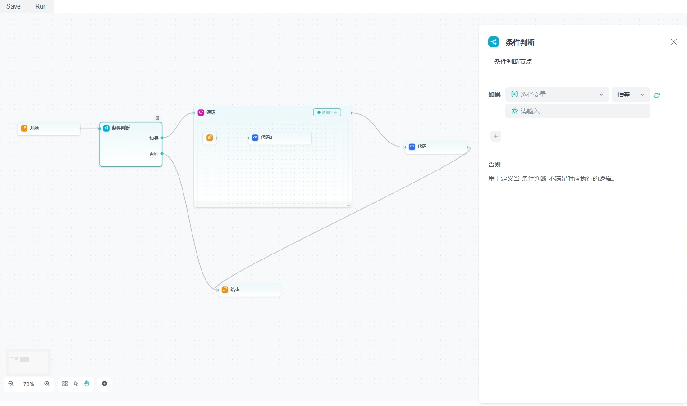

# starter with Vite.js, React.js, Typescript

[在线演示](https://ideepsight.github.io/deep-workflow/)

## 预览



## 使用

```Bash
npm install @deep-sight/workflow


import { DPWorkflow, Workflow } from '@deep-sight/workflow';
import '@deep-sight/workflow/dist/style.css'
import '@arco-themes/react-deep/index.less'; // 可自行去 https://arco.design/themes 更换arcoDesign主题
import '@xyflow/react/dist/style.css'; // 依赖reactFlow

```

## 例子

```TypeScript
import React from 'react';
import { Card, Button } from '@arco-design/web-react';
import { createRoot } from 'react-dom/client';

import { DPWorkflow, Workflow } from '@deep-sight/workflow';
import '@deep-sight/workflow/dist/style.css'
import '@arco-themes/react-deep/index.less';
import '@xyflow/react/dist/style.css';

const App: React.FC = () => {
	const workflow = new DPWorkflow(JSON.parse(localStorage.getItem('wf') || '{}'));

	return (
		<Card bordered={false} bodyStyle={{ height: 'calc(100vh - 80px)', width: '100%', padding: '0 0 50px 0' }}>
			<Button onClick={() => workflow.save()}>Save</Button>
			<Button onClick={() => workflow.run()}>Run</Button>
			<Workflow dpWorkflow={workflow} onSave={(v) => localStorage.setItem('wf', JSON.stringify(v))} autoSave={false} autoSaveInterval={2000} />
		</Card>
	);
};

const root = createRoot(document.getElementById('root'));
root.render(<App />);
```

## 扩展自定义节点

1. `customNodes/end.ts`定义逻辑 class，并注册对应配置组件

```TypeScript
import { DPBaseNode } from '@deep-sight/workflow';
import { End } from './End';

export class EndNode extends DPBaseNode {
	async runSelf(): Promise<void> {} // 必要实现、运行时会被调用
}
DPBaseNode.registerType({
	type: 'customEnd',
	model: EndNode,
	icon: 'zhongdian',
	iconColor: '#f79009',
	NodeComponent: End, // 节点显示组件
	SetComponent: null, // 配置组件
	label: '结束',
	desc: '结束节点',
	group: 'custom'
});

```

2. `customNodes/end.tsx`定义所需组件

```TypeScript
import React from 'react';
import { observer } from 'mobx-react-lite';
import { Handle, Position } from '@xyflow/react';
import { NodeComponentProps } from '@deep-sight/workflow';
import { EndNode } from './end.ts';

export const End: React.FC<NodeComponentProps<EndNode>> = observer(({node}) => {
	return (
		<div>
			<Handle type="target" className="base-handle" position={Position.Left} />
		</div>
	);
});
export const EndSet: React.FC<NodeComponentProps<EndNode>> = observer(({node}) => {
	return (
		<div>
			<Input value={node.desc} onChange={v=> node.desc = v}>
		</div>
	);
});
```

## 计划

-   [x] 运行日志功能
-   [x] 运行错误时自动聚焦到错误节点
-   [x] 中途停止运行
-   [ ] 节点单独测试运行、失败重试运行
-   [ ] 历史记录、上一步、下一步
-   [ ] 第三方节点插件机制、节点市场
-   [ ] 完善文档
-   [ ] 国际化

## 贡献

欢迎参与

fork 代码后

```Bash
pnpm i

npm run dev
```

请求代码合并

## License

-   本仓库遵循 Apache 2.0
-   商业用途请保留出处和 logo
